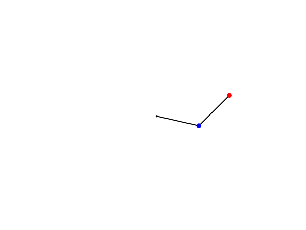

# Double Pendulum (dotnet)
This repository contains a C# implementation of the double pendulum problem.

## Resources

* [Double pendulum](https://en.wikipedia.org/wiki/Double_pendulum) on Wikipedia

* [The double pendulum problem](https://matplotlib.org/stable/gallery/animation/double_pendulum.html#sphx-glr-gallery-animation-double-pendulum-py) solved in Python and displayed with matplotlib